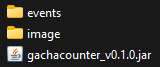
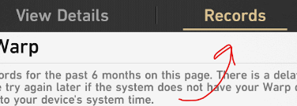
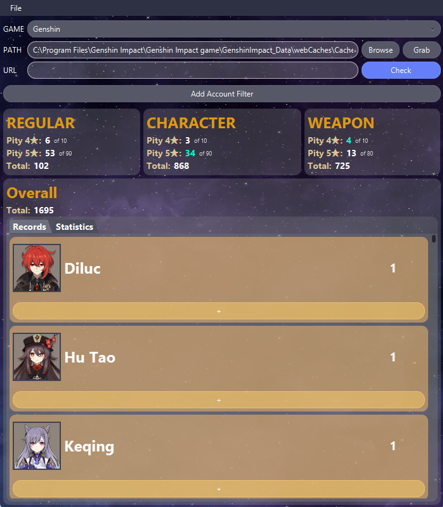
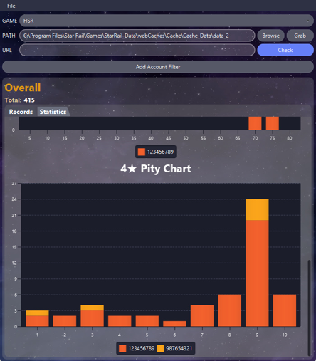

# Gacha Counter

An unofficial desktop tool to track and view your gacha records for Honkai Star Rail and Genshin Impact.

* Herta gif: Seseren (Twitter: [@Seseren_kr](https://twitter.com/Seseren_kr))
* All other media related to Honkai Star Rail or Genshin Impact belongs to miHoYo/HoYoverse.

## Installation

1. Download JAVA 17 ([Java SE 17 Archive Downloads](https://www.oracle.com/java/technologies/javase/jdk17-archive-downloads.html)).
2. Download the latest version of the tool into an empty folder ([download](https://github.com/daitenshionyan/gachacounter/releases/latest/download/gachacounter_v0.2.0.jar)).
3. Launch the application by double clicking the jar file. From the menu bar at the top, navigate - `Help` > `Download data files`. This will download the required data files such as the item icon pictures.

The contents of the folder should look something like this:



## Updating

### Game

When the game updates, repeat step 3. If files are not updating, try again at a later time.

### Application

Replace the .jar file with the newer version.

## Usage

1. Launch the game whose records you wish to track and open your wish/wrap history. Ensure to open till the **Records** page for HSR.<br>

2. Close the game.
3. Launch the tool by double clicking the .jar file.
4. Select the game corresponding game in step 1.
5. Click the **Browse** button and navigate to the `data_2` file of the game. Example:
     1. HSR -- `C:\Program Files\Star Rail\Games\StarRail_Data\webCaches\Cache\Cache_Data\data_2`
     2. Genshin -- `C:\Program Files\Genshin Impact\Genshin Impact game\GenshinImpact_Data\webCaches\Cache\Cache_Data\data_2`
6. Click the **Grab** button.
7. Click the **Check** button.

Step 5 only has to be done once for each game.

 

## Building

```text
./gradlew build
```
